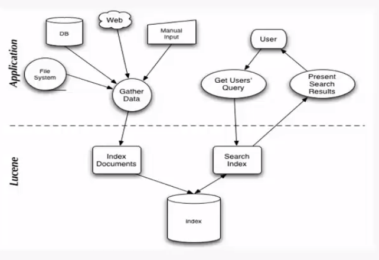
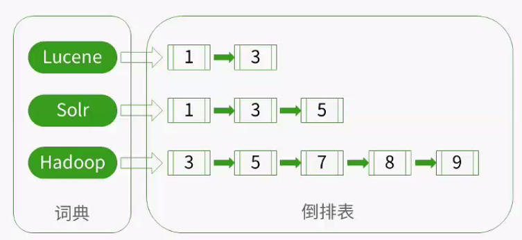
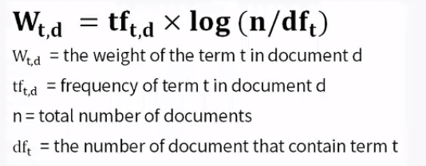
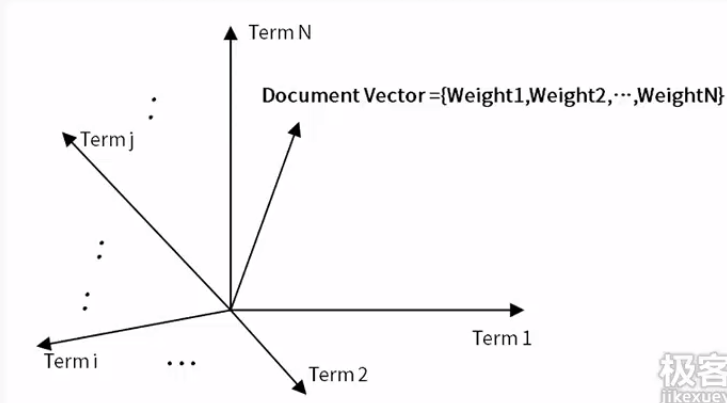
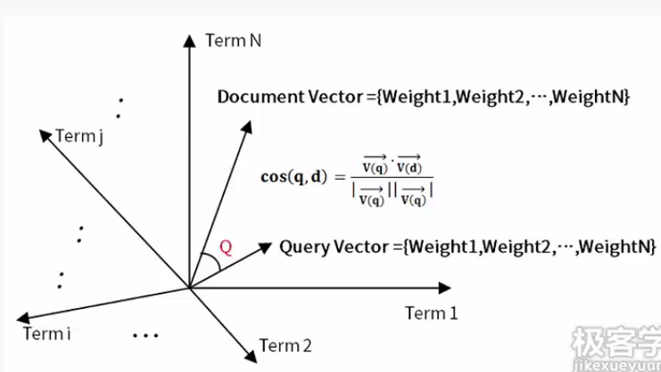

# Lucene - 学习笔记

## 1. 概述
### 1.1 数据分类
- 结构化数据：具有固定格式或有限长度的数据（数据库、SQL语句）；
- 非机构化数据：不定长度或无固定格式的数据（顺序扫描、全文检索）；
- 半结构化数据：结合结构化与非结构化数据（XML/JSON）；

### 1.2 全文检索过程

- **创建索引**：将结构化、非结构化数据、半结构化数据，通过Lucene创建索引文件；
- **用户检索**：通过获取用户检索的关键词，检索索引库，将结果返回给用户；

### 1.3 索引定义

- 索引：由词典和倒排表组成；
- 反向索引：由字符串到文件的映射，是文件到字符串的反向过程；
### 1.4 过程分解
- 创建检索
	- 准备需要检索的数据（Document）；
	- 采用分词技术（Analyzer）；
	- 创建索引（Indexer）；
- 索引检索
	- 搜索关键字（Keywords）；
	- 分词技术（Analyzer）；
	- 检索索引（Search）；
	- 返回结果；

>  **标准分词**：将中文转换为一个个汉字，将英文转换成词根；

## 2. Lucene 数学模型

### 2.1 基本概念
`文档`是`Lucene`索引和搜索的原子单位，文档为包含一个或多个`域`的容器，而域则依次包含真正的被搜索的内容，`域值`通过分词技术处理，得到多个`词元`，真正搜索的内容的词元。
- 一篇小说信息可以成为一个文档；
- 小说信息包含作者、标题、简介，这些称为域；
- 对标题采用分词技术，又可以得到多个词元；

### 2.2 词元权重计算
**基本概念：**
- `Term Frenquency(TF)`：此`Term`在文档中出现的次数，`TF`越大，说明该词元越重要；
- `Ducument Frequency(DF)`：即多少文档包含此`Term`，`DF`越大，说明该词元越不重要；

**计算公式：**

- `W(td)`：词元t在文档d中的权重；
- `tf(td)`：词元t在文档d出现的次数；
- `df(t)`：词元t在几个文档中出现；
- `n`：文档总数；

### 2.3 空间向量模型

- `Term(1...N)`：词元在该文档上的权重，用一个向量表示；
- `Document Vector`：由各个词元的向量的分量组成，代表这个文档的N维空间向量；

**备注：**
- 若文档不包含某个词元，那么文档在该词元上的分量为0；
- 所有的文档都可以表示为一个N维空间向量；

### 2.4 索引检索

- `Query Vector` 和计算文档的空间向量一样，将搜索词也用相同的技术，转换成一个空间向量；
- 可以用余弦定理，计算`DocumentVector`和`QueryVector`之间的夹角；
- 二者的夹角越大，相关性越大，夹角越小，相关性越小；

## 3. Lucene 文件结构
### 3.1 层次结构
- 索引 - `Index`：一个索引放在一个文件夹中；
- 段 - `Segment`：一个索引中可能有很多段，段与段之间是独立的，添加文档可能产生新的段，不同的段可以合并成一个新段；
- 文档 - `Document`：文档是创建索引的基本单位，不同的文档保存在不同的段中，一个段可以包含多个文档；
- 域 - `Field`：一个文档包含不同类型的信息，可以拆分开索引；
- 词 - `Term`：词是索引的最小单位，是经过词法分析和语言处理后的数据；

> **索引**相当于数据库中的表。当表的数据达到一定量就要做分区处理，**段**就相当于分区。**文档**相当于保存在分区中的数据库记录。

### 3.2 正向信息
正向信息就是按层次保存了索引一直到词的包含关系：**索引 -> 段 -> 文档 -> 域 -> 词**；

### 3.3 反向信息
反向信息保存了词典的倒排表映射：**词 -> 文档**，可以体现出词在哪些文档中出现；

