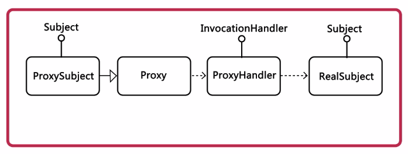

# Java 动态代理 - 学习笔记

## 1. 简介
### 1.1 代理模式
> **定义**：为其他对象提供一种代理以控制这个对象的访问。代理对象起到中介作用，可以去掉功能服务或增加额外的服务。

### 1.2 常见的代理模式
- 远程代理：为不同地理的对象提供局域网的代表对象；
- 虚拟代理：根据需要将资源消耗很大的对象进行延迟，真正需要的时候进行创建；
- 保护代理：控制用户的访问权限，对代理对象的权限进行控制；
- 智能引用代理：提供对目标对象额外的服务；


## 2. 代理模式实现
### 2.1 静态代理
> **定义**：带和和被代理的对象在代理之前是确定的，他们都是实现相同接口或继承自相同的抽象类。

``` java
//被代理类实现的接口
public interface Moveable {
    void move();
}
//需要被代理的类
public class Car implements Moveable {}
```

#### 2.1.1 继承实现
- 将代理集成被代理类；
- 覆盖代理实现的方法，调用父类的方法，并个在其前后增加需要附加的代码；
- 使用时直接构造代理类即可，将代理类当做被代理类使用；
- **注意**：使用继承的方式，不利于代理类的叠加，不是推荐的方式；
``` java
public class CarInheritedProxy extends Car {
    @Override
    public void move() {
        //do something...
        //继承静态代理，调用被代理的方法
        super.move();
		//do something...
    }
}
```
#### 2.1.2 聚合实现
- 将代理实现被代理类的接口，并持有被代理对象；
- 提供构造方法，使用被代理对象构造代理对象；
- 实现接口方法，并调用被代理对象的同样方法，在前后增加需要附加的代码；
- **推荐**：相比集成代理，利于切面功能的组合和叠加；

``` java
public class CarCompositeProxy  implements Moveable{
    //被代理的对象
    private Moveable moveable;
	//构造函数
    public CarCompositeProxy(Moveable moveable) {
        this.moveable = moveable;
    }

    @Override
    public void move() {
        //do something...
        //聚合静态代理，调用被代理的方法
        moveable.move();
		//do something...
    }
}
```

### 2.2 JDK 动态代理
#### 2.2.1 基本概念
- 在运行时产生`class`；
- 该`class`需要实现一组`interface`；如果没有实现某些接口，则不能实现JDK的动态代理；
- 实现动态代理类时，必须要实现`InvocationHandler`接口；

#### 2.2.2 关键元素

- `InvocationHandler#invok` - 事务处理器
	- `obj`：被代理的对象；
	- `method`：被代理的方法；
	- `args`：改方法的参数组；
- `Proxy#newProxyInstance` - 产生动态代理类
	- `loader`：类加载器；
	- `interface`：被代理类实现的接口；
	- `h`：事务处理器`invocationHandler`；

#### 2.2.3 实现步骤
- 创建实现`InvocationHandler`的类，必须实现`invoke`方法；
- 创建被代理的类以及接口；
- 调用`Proxy`的静态方法`newProxyInstance`方法，创建一个代理类；

动态代理处理器类：
``` java
public class TimeHandler implements InvocationHandler {
    //被代理的对象
    private Object target;
    //使用被代理的对象构造
    public TimeHandler(Object traget) {
        this.target = traget;
    }
    @Override
    public Object invoke(Object proxy, Method method, Object[] args) throws Throwable {
        //do something...
        //调用被代理的方法
        method.invoke(target, args);
        return null;
    }
}
```

使用动态代理：
``` java
public class JdkProxyTester {
    @Test
    public void testTimeHandler() {
        Car car = new Car();
        //构造处理器
        InvocationHandler h = new TimeHandler(car);
        //获得代理类
        Moveable m = (Moveable)Proxy.newProxyInstance(car.getClass().getClassLoader(), new Class[]{Moveable.class}, h);
        //调用被代理方法
        m.move();
    }
}
```

### 2.3 CGLIB 动态代理
#### 2.3.1 基本概念
- 针对类实现动态代理；
- 对指定的目标类产生一个子类，通过方法拦截技术拦截所有的父类方法的调用；
- 不能对`final`修饰的类进行代理；

#### 2.3.2 实现方法
- 代理类实现`MethodInterceptor`接口；
- 代理类实现`intercept`方法；
	- `object` - 被代理的对象实例；
	- `method` - 被代理的方法的反射对象；
	- `args` - 方法的调用参数；
	- `proxy` - 方法的代理对象；需要调用其`invokeSuper(o, args)`执行父类的方法；
- 使用`Enhancer`类创建被代理类的子类；

``` java
public class CglibProxy implements MethodInterceptor {
    private Enhancer enhancer = new Enhancer();
    public Object getProxy(Class clazz){
        //创建类的子类
        enhancer.setSuperclass(clazz);
        enhancer.setCallback(this);
        //创建对象
        return enhancer.create();
    }
    
    public Object intercept(Object o, Method method, Object[] args, MethodProxy methodProxy) throws Throwable {
        System.out.println("日志开始...");
        //调用代理类父类的方法
        methodProxy.invokeSuper(o, args);
        System.out.println("日志结束...");
        return null;
    }
}
```

## 3. 实现原理
### 3.1 基本原理
- 声明一段源码（动态产生代理类）；
- 编译源代码`JDK Compiler API`，产生新的代理类；
- 将类加载的内存中，产生一个新的对象（代理对象）；

### 3.2 实现要点
- 根据原有接口，拼接实现类的代码字符串；
- 将生成的源代码输出到`.java`文件中；
- 使用`JavaCompiler`类生成编译任务`CompilationTask `进行编译；
- 使用类加载器`ClassLoader`将类加载到内存中；
- 获取类的构造器`Constructor`并创建代理对象的实例；

```
public class Proxy {
    public static Object newProxyInstance(Class infce, InvocationHandler h) throws Exception {
        //拼装代码
        String source = generateProxySourceCode(infce);

        //输出文件
        String fileName = System.getProperty("user.dir") + "\\target\\classes\\learning\\java\\proxy\\diy\\$Proxy0.java";
        System.out.println(fileName);
        File file = new File(fileName);
        FileUtils.writeStringToFile(file, source, "UTF-8");

        //获取系统编译器
        JavaCompiler compiler = ToolProvider.getSystemJavaCompiler();
        //获取文件管理器
        StandardJavaFileManager fileManager = compiler.getStandardFileManager(null, null, null);
        //获取文件
        Iterable<? extends JavaFileObject> units = fileManager.getJavaFileObjects(file);
        //获取编译任务
        JavaCompiler.CompilationTask task = compiler.getTask(null, fileManager, null, null, null, units);
        //编译
        task.call();
        //关闭文件管理器
        fileManager.close();

        //获取类加载器
        ClassLoader cl = ClassLoader.getSystemClassLoader();
        //加载类
        Class<?> c = cl.loadClass("learning.java.proxy.diy.$Proxy0");

        //获取构造器(在动态源码中编写的)
        Constructor<?> constructor = c.getConstructor(InvocationHandler.class);
        //创建对象
        return constructor.newInstance(h);
    }
}
```